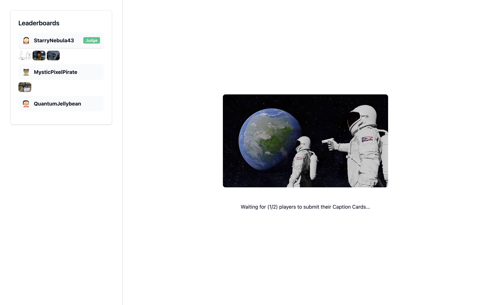
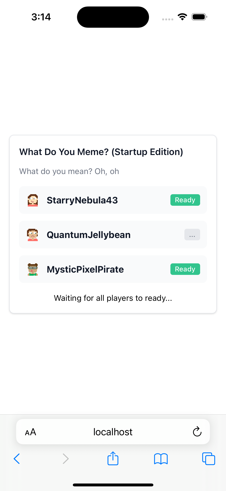

# What Do you Meme? (Startup Edition)

A weekend project with Solid.js and Deno as a socket.io server.  

  

  
  
  

## Running the app
- `pnpm install`
- `pnpm concurrently "pnpm dev" "deno task dev"`

## Credits
- https://whatdoyoumeme.com.au/
- https://imgflip.com/
- https://chat.openai.com/